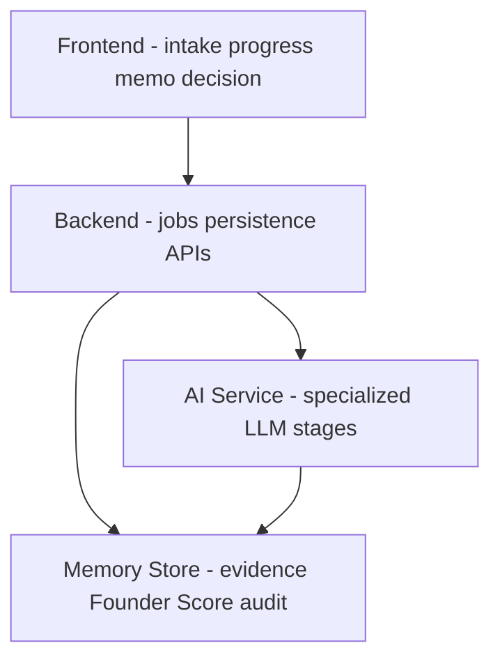
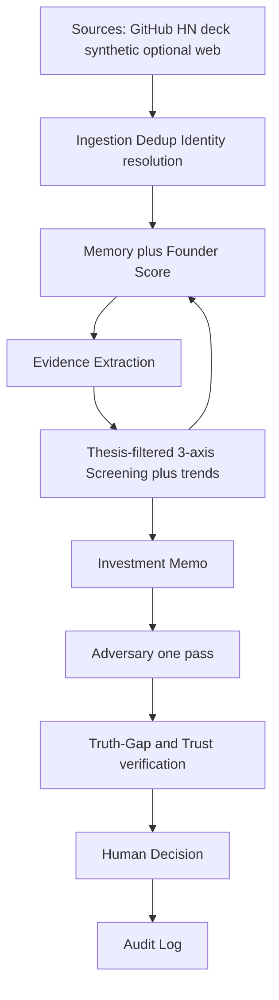
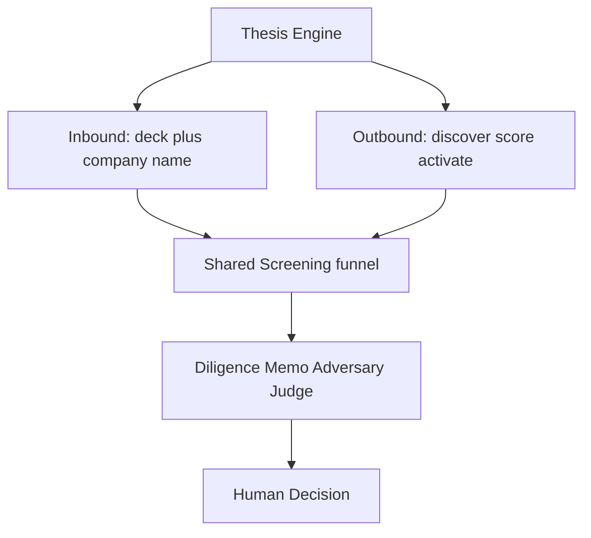
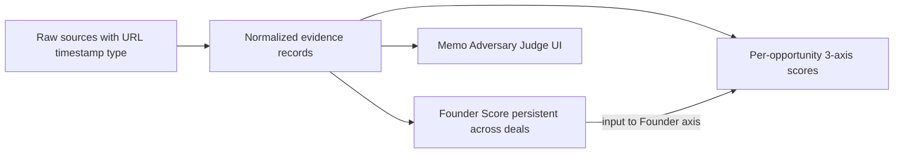
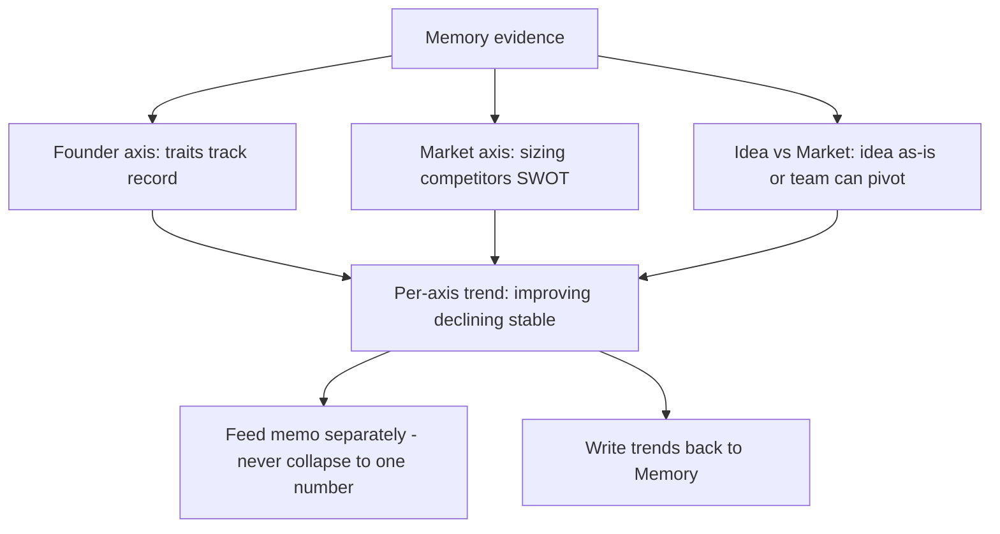
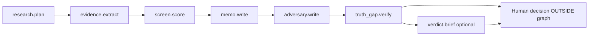
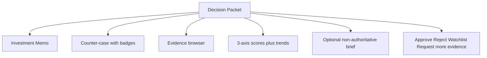
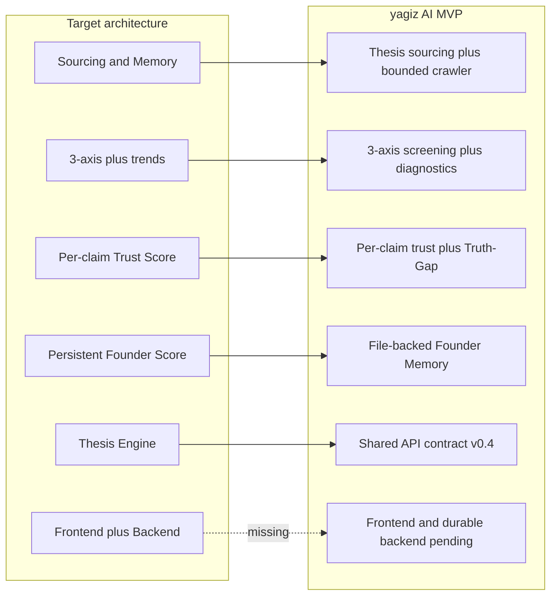

# VentureIntelligence

**An Evidence-Grounded Bounded AI System for Cold-Start Founder Discovery and Transparent Venture Decision Support**

Hack-Nation Challenge 2 — **The VC Brain: Deploying $100K Checks in 24 Hours** (Maschmeyer Group × MIT Clubs).

This plan is the team architecture source of truth. The official challenge brief remains on the [architecture-plan branch](https://github.com/Moneeb-Hussain/venture-intelligence/blob/archi-plan/challenge2.pdf).

---

## Table of contents

1. [Positioning and scope](#1-positioning-and-scope)
2. [Problem and product vision](#2-problem-and-product-vision)
3. [Judging criteria and three pillars](#3-judging-criteria-and-three-pillars)
4. [Architecture diagrams](#4-architecture-diagrams)
5. [Component reference](#5-component-reference)
6. [Evidence schema](#6-evidence-schema)
7. [Bounded LLM pipeline](#7-bounded-llm-pipeline)
8. [Investment memo requirements](#8-investment-memo-requirements)
9. [Users](#9-users)
10. [Non-goals](#10-non-goals)
11. [Repo status and implementation notes](#11-repo-status-and-implementation-notes)
12. [Team pointers](#12-team-pointers)

---

## 1. Positioning and scope

VentureIntelligence is a data- and AI-first venture investment **decision-support** system. It helps a human investor:

- discover exceptional founders **before** they formally fundraise;
- accept inbound applications (company name + pitch deck);
- collect and structure fragmented founder and company data;
- screen opportunities on **independent** axes;
- verify claims against evidence;
- produce an evidence-backed investment memo and a skeptical counter-case;
- decide on a **$100K** check within **24 hours**.

### In scope (MVP)

**Sourcing → Screening → Diligence → Decision**

### Out of scope (MVP)

Portfolio monitoring, fund operations, follow-on investing, and exits. Do not spend hackathon time designing UI for those stages.

---

## 2. Problem and product vision

### The cold-start founder problem

Strong founders are often missed because their work is fragmented across GitHub, Hacker News, hackathons, papers, websites, pitch decks, launches, and social profiles. Traditional sourcing favors networks, prior funding, and visibility.

VentureIntelligence identifies promising founders from **observable execution evidence**, even when they have:

- no prior institutional VC funding;
- no established investor network;
- no prestigious accelerator;
- limited public visibility;
- no previous startup exit.

### Product story

An investor defines a fund thesis, for example:

> Find technical founders in Europe building AI infrastructure, with early enterprise traction, no previous institutional VC funding, and strong evidence of execution.

The system then:

1. interprets the thesis;
2. searches public and uploaded sources;
3. discovers potential founders;
4. merges duplicate profiles;
5. extracts evidence-backed signals;
6. evaluates each opportunity on three independent axes;
7. generates an investment memo;
8. generates a skeptical counter-case;
9. verifies the counter-case against the same evidence;
10. presents memo and objections side by side;
11. lets the human approve, reject, or request more evidence;
12. records the complete decision trail.

### What we are not building

| Not this | Instead |
|----------|---------|
| A swarm of agents debating endlessly | A small number of specialized LLM calls with clear jobs |
| Autonomous investing | Human investor owns the final decision |
| AI declaring memo vs adversary the “winner” | Side-by-side packet; optional non-authoritative brief only |
| Generic “ChatGPT for investors” | Every important conclusion tied to evidence, confidence, gaps, and contradictions |

---

## 3. Judging criteria and three pillars

### Evaluation weights ([`challenge2.pdf`](challenge2.pdf))

| Weight | Criterion | What judges look for |
|--------|-----------|----------------------|
| **30%** | Data Architecture & Intelligence | Smart ingest, dedupe, enrichment; honest about unknowns; **cold-start / pre-track-record** method |
| **25%** | Intelligent Analysis & Trust | Decision-ready insights; **per-claim Trust Scores**; evidence + uncertainty |
| **30%** | Investment Utility & Execution | A human could act within **24 hours**; signal → decision reliability |
| **15%** | User Experience & Design | Notion-level approachability, Bloomberg-level depth |

**Priority hint from the brief:** go furthest on **sourcing / data**. A polished reasoner over shallow data scores poorly. Build sourcing deep, then a thin-but-transparent intelligence layer on top.

### Three pillars

1. **Sourcing** — Surface the strongest founders before fundraising. Highest MVP priority. Judged on data richness and smart sourcing ideas, not polish.
2. **Assessment & Intelligence** — Reasoning on Memory: insights, challenged assumptions, next steps. Transparent about confidence and evidence. Triggered by inbound application or outbound conviction threshold.
3. **Memory** — Nothing discarded. Deduplicate, enrich, timestamp, tag by source. Houses the **Founder Score** (persists across applications, never resets). Surfaces **trends**, not only the latest snapshot.

### MVP must-haves

1. **Thesis Engine** — Configurable sectors, stage, geography, check size, ownership targets, risk appetite. Every recommendation filtered through this lens.
2. **Smart data collection** — Collect, validate, and structure founder/company data from heterogeneous sources.
3. **Multi-attribute NL queries** — e.g. “technical founder, Berlin, AI infra, enterprise traction, no prior VC backing, top-tier accelerator” in one pass.
4. **Inbound** — Minimum: deck + company name. Fast first-pass screen before full analysis.
5. **Outbound** — Scan GitHub, launches, hackathons, papers/patents, accelerator cohorts; score like inbound; activate via outreach (not auto-invest); converge into the same Screening funnel.
6. **3-axis screening (not averaged)** — Founder · Market · Idea vs Market; each with trend (improving / declining / stable); feeds Memory.
7. **Evidence-backed memos + per-claim Trust Score** — Verify externally where possible; flag contradictions before they reach the investor.
8. **Investor-grade UX** — Usable without technical support.

---

## 4. Architecture diagrams

### Diagram A — High-level system layers



### Diagram B — End-to-end pipeline



### Diagram C — Inbound and outbound converge



Outbound **activates** founders (outreach to trigger a real application). It does not auto-invest. Activated applications enter the same Screening step as inbound.

### Diagram D — Memory and evidence provenance



**Founder Score ≠ 3-axis score.** Founder Score lives in Memory, follows the person across startups, and never resets. The 3-axis score is per opportunity. Founder Score is one input into the Founder axis, not a substitute for it.

### Diagram E — Three-axis screening (not averaged)



Market axis rating: **bullish / neutral / bear**. Collapsing axes into one average hides the disagreement investors need to see.

### Diagram F — Bounded LLM pipeline



Human decision is **outside** the orchestration graph. No agent debate loop.

### Diagram G — Decision packet (side-by-side UX)



Objection badges from the truth-gap Judge: `verified` | `unverified` | `speculation`.

### Diagram H — Target vs current implementation status



---

## 5. Component reference

### 5.1 Ingestion layer

Collects from:

| Source | Role |
|--------|------|
| GitHub API | Repos, releases, stars, activity (execution evidence) |
| Hacker News API | Launches, discussion signals |
| Uploaded pitch decks | Inbound claims to verify |
| Synthetic founder profiles | Demo / seeded contradictions |
| Optional | Company websites, Product Hunt, arXiv, hackathon pages |

Responsibilities:

- capture raw content;
- assign source ID;
- retain source URL and timestamps;
- identify source type;
- store raw and normalized content;
- never silently discard source data.

Every evidence item must have **provenance**.

Crawler guardrails:

- Respect robots and rate limits.
- Store source URLs and timestamps.
- Preserve canonical URL, content hash, source channel, and published time when available.
- Deduplicate identical or near-identical content.
- Prefer primary sources.
- Label stale or low-confidence evidence.
- Never let a crawler summary replace source-backed Memory.

### 5.2 Thesis Engine

Investor-configurable:

- sectors / themes;
- stage;
- geography;
- check size;
- ownership targets;
- risk appetite.

Every recommendation is filtered and scored through this fund-specific lens. Hardcoding a single thesis misses the point of the pillar.

Supports multi-attribute natural-language queries resolved in one pass (not five manual filters).

### 5.3 Memory and Founder Score

Memory is the shared source of truth between all LLM stages and the UI.

Rules:

- The memo cannot make uncited factual claims.
- The adversary cannot invent facts.
- Every adversarial objection must cite an `evidence_id` or be labeled `speculation`.
- Speculation is allowed only as risk reasoning, not as a factual assertion.
- The truth-gap Judge badges objections with missing, irrelevant, or contradicted evidence as `unverified`.

**Founder Score:** a living profile of skills, experience, and track record that gets sharper with every milestone — a credit score for founders. Produced by the system, persisted across applications, used as one input into every investment decision (especially the Founder axis).

### 5.4 Evidence extraction and Trust Score

Evidence Extractor converts crawled or uploaded content into structured Memory records.

**Trust Score is per claim**, not one company-level number. Each assertion (traction, revenue, team background, market size) traces to evidence with a confidence level, verified externally where possible, with contradictions flagged before they reach the investor.

### 5.5 Screening (target: 3 axes)

| Axis | Meaning |
|------|---------|
| **Founder** | Who they are, traits, track record; Founder Score is one input |
| **Market** | Sizing, competitors, SWOT → bullish / neutral / bear |
| **Idea vs Market** | Does the idea survive as-is, or is the team strong enough to pivot? |

Each axis shows **trend** (improving / declining / stable) and feeds back into Memory.

Cold-start method must be explicit: pre-track-record founders need a defined scoring path (public footprint, execution artifacts, deck claims under verification) — otherwise the system rebuilds the network-gated status quo.

### 5.6 Investment memo

See [§8](#8-investment-memo-requirements). Memo Writer produces the strongest **honest** invest case supported by Memory, with citations.

### 5.7 Adversary and Judge

**Adversary (one pass):** strongest case against investing, focused by the weakest screening signal. Constraints: one pass only; no arguing back; no new crawling; no invented facts; every objection evidence-backed or explicitly `speculation`.

**Truth-gap Judge:** badges each objection `verified` | `unverified` | `speculation`. Treats objections as claims against Memory, not as a debate partner.

**Optional verdict brief:** short, non-authoritative summary of whether verified objections look decision-changing. Must not declare the final decision.

### 5.8 Audit log

Records reviewer identity, timestamp, decision (`approve` / `reject` / `watchlist` / `needs_more_research`), notes, and references to the decision packet version used.

---

## 6. Evidence schema

Example evidence object (provenance-first):

```json
{
  "evidence_id": "ev_001",
  "founder_id": "founder_001",
  "source_type": "github",
  "source_url": "https://github.com/example/project",
  "source_title": "Example Project",
  "observed_at": "2026-07-19T12:00:00Z",
  "published_at": "2026-07-12T00:00:00Z",
  "content": "Repository has 24 releases and 410 stars.",
  "credibility": 0.9
}
```

Normalized Memory fields used across stages (aligned with the AI contract direction):

| Field | Purpose |
|-------|---------|
| `evidence_id` | Stable ID (e.g. `ev_001`) |
| `founder_id` / `deal_id` | Who / which opportunity |
| `source_url` / `source_title` | Provenance |
| `observed_at` / `published_at` / `captured_at` | Freshness |
| `claim` / `content` / `quote` | Normalized fact + supporting snippet |
| `evidence_type` | company, founder, market, traction, competition, fundraising, risk, unknown |
| `confidence` / `credibility` | Trust signal |
| `freshness` | current, stale, or unknown |

---

## 7. Bounded LLM pipeline

Specialized stages (callable independently for isolation and demos):

| Stage | Job |
|-------|-----|
| `research.plan` | Search queries, target URLs, priorities, expected evidence types |
| `research.crawl` | Fetch pages (workers); raw text + metadata → Memory via extract |
| `evidence.extract` | Pages → structured evidence records |
| `screen.score` | 3-axis scores, rationales, missing evidence, trends, weakest axis |
| `memo.write` | Evidence-cited investment memo + recommendation |
| `adversary.write` | One-pass counter-case with citations or speculation labels |
| `truth_gap.verify` | Badge each objection; contradiction / relevance checks |
| `verdict.brief` | Optional non-authoritative reviewer brief |
| `packet.build` | Final reviewer-ready decision packet |

Truth-gap Judge rules (summary):

- Evidence supports objection → `verified`
- Cited evidence does not support → `unverified`
- Factual claim without evidence → `unverified` (unless clearly speculation)
- Risk reasoning from missing/weak evidence → `speculation`
- Contradicts stronger Memory evidence → `unverified` + cite contradiction

---

## 8. Investment memo requirements

Length rule: as detailed as the decision requires, as brief as clarity allows. Padding counts against you.

**Required sections** (challenge appendix):

| Section | Should include |
|---------|----------------|
| Company snapshot | One-paragraph nutshell: market size, structural problem, urgency, how the product solves it |
| Investment hypotheses | Explicit “why invest” bullets (team, wedge, stickiness, traction, defensibility, expansion) |
| SWOT | Strengths, weaknesses, opportunities, risks — short, evidence-backed bullets |
| Problem & product | Core problem(s) in plain language; step-by-step product/process |
| Traction & KPIs | Customers, ARR/revenue, growth, unit economics, usage metrics |

Where data is missing (financials, cap table, etc.): **flag explicitly** (e.g. “Cap table: not disclosed”). Do not fabricate. A memo that marks its own gaps is more trustworthy.

Other appendix sections (team & history, technology, market sizing, competition, financials, cap table, DD log, exit) are welcome when evidence exists, optional when it does not.

---

## 9. Users

### Investor (primary)

- Define thesis;
- discover overlooked founders;
- review inbound applications;
- understand why a founder was surfaced;
- inspect supporting evidence;
- compare strengths, risks, and contradictions;
- decide within 24 hours.

### Founder

- Submit company name;
- upload pitch deck;
- optionally provide key public links;
- enter the **same funnel** as outbound-discovered founders.

---

## 10. Non-goals

- Portfolio monitoring, follow-on, fund ops, or exit workflows in the MVP.
- Open-ended multi-agent debate or consensus loops.
- Autonomous capital deployment without human approval.
- AI declaring a final winner between memo and adversary.
- Over-collecting founder application fields beyond what a confident 24-hour decision needs (minimum: deck + company name).

---

## 11. Repo status and implementation notes

### Branch roles

| Branch / path | Role |
|---------------|------|
| `archi-plan` (this README) | Architecture source of truth |
| `origin/yagiz` | Existing AI service + `api-contract.json` |
| `challenge2.pdf` | Official challenge brief |

### What exists on `yagiz`

```text
README.md              # Product and architecture documentation
api-contract.json      # Shared v0.4 FE/BE/AI contract
ai_service/
  core.py              # Deterministic stage logic, trust and 3-axis scoring
  crawler.py           # Bounded public-web crawler
  sourcing.py          # Thesis planning, discovery and ranking
  memory.py            # File-backed Founder Memory MVP
  runtime.py           # Stage wrappers
  model_router.py      # Optional OpenAI routing
  orchestration.py     # LangGraph diligence DAG (+ sequential fallback)
  sourcing_orchestration.py # LangGraph sourcing DAG
  server.py            # HTTP /v1/ai/* on :8001
  tests/ examples/
```

Implemented AI HTTP stages include `sourcing.plan`, `research.crawl`,
`sourcing.discover`, `sourcing.rank`, `sourcing.run`, `founders.memory.*`,
`research.plan`, `evidence.extract`, `evidence.verify`, `screen.score`,
`memo.write`, `adversary.write`, `truth_gap.verify`, and `verdict.brief`.

The `0.4.0` contract now defines versioned theses, a pre-deal `SourcingJob`,
candidate lifecycle and activation, provisional founder identity references,
source provenance, normalized Memory claims, human decision audit records, and
source-channel outcome feedback. Every AI endpoint has a typed request and
response schema.

### Remaining gaps vs this target architecture

| Target | Current state |
|--------|-----------------|
| Thesis-driven outbound sourcing | AI MVP is implemented; direct GitHub/HN/accelerator adapters remain future enrichment work |
| Persistent Memory DB + Founder Score | File-backed AI MVP implemented; backend must own durable multi-user storage and reviewed identity merges |
| **3-axis** screening + trends | Implemented; supporting diagnostics remain visible but are not averaged |
| Challenge memo sections (SWOT, etc.) | Implemented with explicit data gaps and diligence log |
| Per-claim Trust Score + external verify | Implemented; deterministic mode has heuristic contradiction detection, while model-backed mode requires external source review |
| Frontend + Backend orchestration | Contract ready; frontend, durable backend, jobs, activation/outreach, and human decision persistence remain to be built |

**Alignment rule going forward:** implement and document against the **3-axis +
Memory + sourcing** target in this README. The remaining work is operational
ownership and source-depth, not a redesign of the bounded decision pipeline.

### Suggested demo flow

1. Investor sets thesis (or uses a demo thesis).
2. Inbound: company name + deck — or outbound: discovered founder activated into the funnel.
3. Research / ingest runs; evidence appears with provenance.
4. 3-axis scores and trends appear (not averaged).
5. Memo generated from cited Memory (required sections + explicit gaps).
6. One-pass adversary + truth-gap badges.
7. Optional brief; human approves / rejects / requests more evidence; audit log written.

### Success criteria

- A judge can understand why the system surfaces or recommends a founder.
- Every important factual claim has a source and a Trust signal.
- Cold-start founders have an explicit evaluation path.
- Counter-case is strong but bounded; Judge catches unsupported attacks.
- Human remains the final authority on the $100K decision.

---

## 12. Team pointers

| Resource | Location |
|----------|----------|
| This architecture doc | [`README.md`](README.md) (you are here) |
| Challenge brief | [`challenge2.pdf`](challenge2.pdf) |
| AI service + contract | Branch `yagiz` / `origin/yagiz` — `ai_service/`, `api-contract.json` |

### Parallel work

- **Frontend** — intake, progress, evidence browser, 3-axis dashboard, memo vs counter-case, decision actions.
- **Backend** — versioned theses, sourcing jobs, candidates, durable Memory and identity merge review, activation/outreach, deals, jobs, packet assembly, human audit, source outcomes.
- **AI / data** — bounded crawling, source adapters, extraction, Trust validation, Thesis Engine, 3-axis screen, memo, adversary, truth-gap, and model-backed web discovery.

Use a shared API contract so FE, BE, and AI can develop against the same schemas.

---

*VentureIntelligence — evidence first, human decides.*
