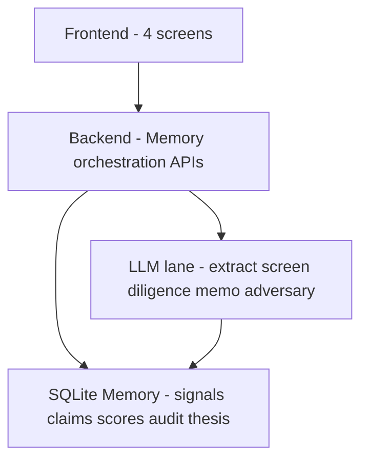
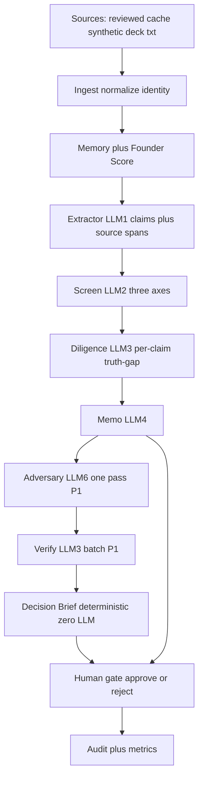
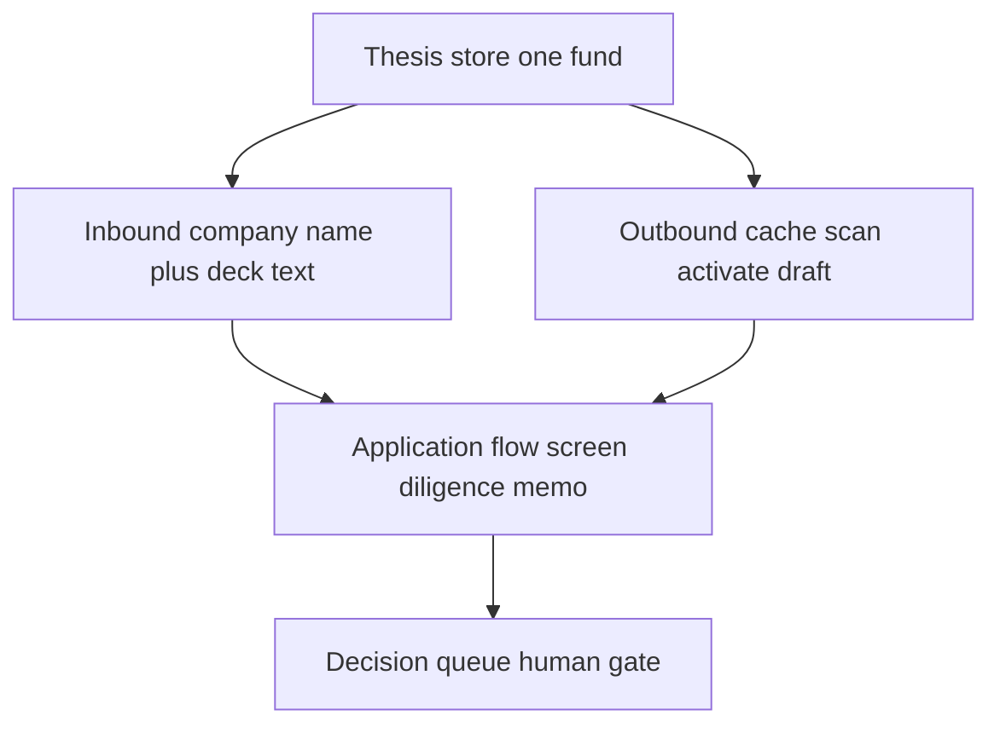
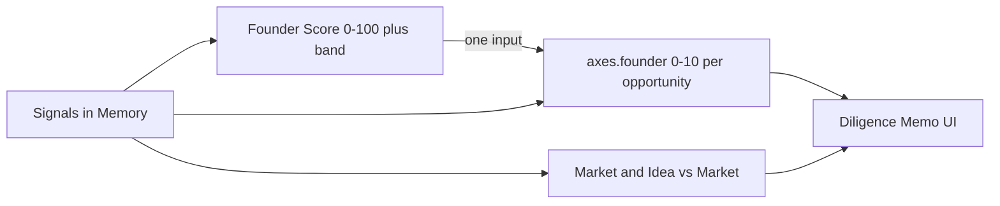
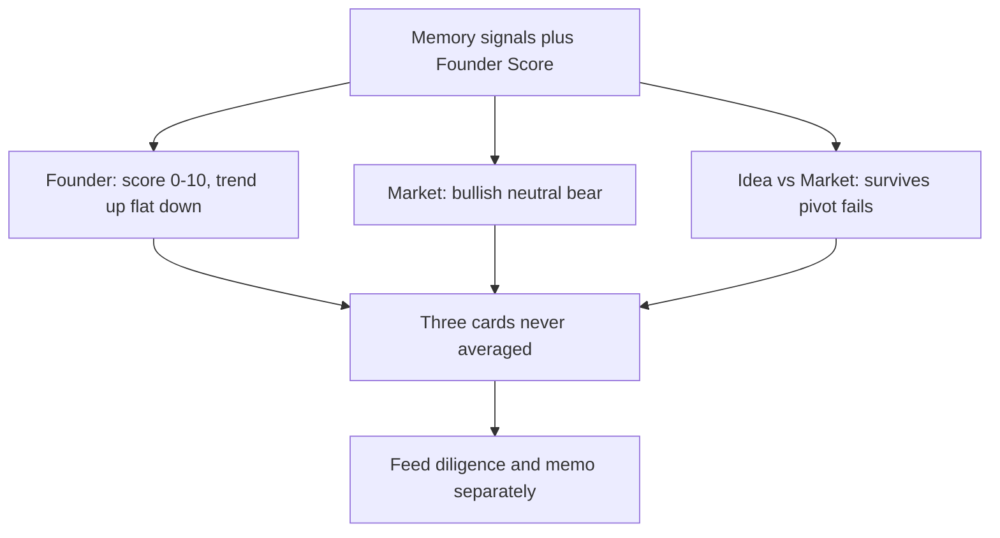
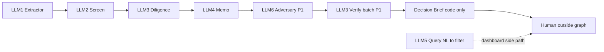
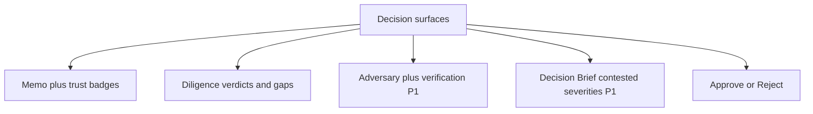
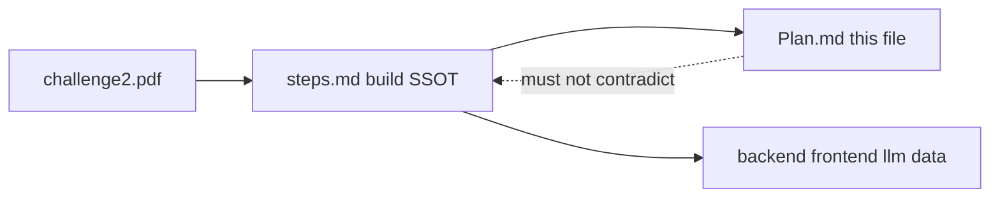

# VentureIntelligence

**An Evidence-Grounded Bounded AI System for Cold-Start Founder Discovery and Transparent Venture Decision Support**

Hack-Nation Challenge 2 — **The VC Brain: Deploying $100K Checks in 24 Hours** (Maschmeyer Group × MIT Clubs).

### Document roles

| Doc | Role |
|-----|------|
| **[`steps.md`](steps.md)** | **Build contract (source of truth)** — golden path, API shapes, pipeline rules, formulas, scope P0/P1/P2, lane ownership, 20-hour order |
| **This `Plan.md`** | Architecture narrative — challenge framing, diagrams, component intent. Must not contradict `steps.md` |
| [`challenge2.pdf`](challenge2.pdf) | Official challenge brief |

**If this file and `steps.md` disagree on behavior, `steps.md` wins.**

One-liner (from `steps.md`): live-sourced founders + inbound decks → one Memory → 3-axis screen → per-claim truth-gap check → evidence-linked memo → adversary + verify → **deterministic Decision Brief** → human approves the $100K.

---

## Table of contents

1. [Positioning and scope](#1-positioning-and-scope)
2. [Problem and product vision](#2-problem-and-product-vision)
3. [Judging criteria and three pillars](#3-judging-criteria-and-three-pillars)
4. [Architecture diagrams](#4-architecture-diagrams)
5. [Component reference](#5-component-reference)
6. [Evidence and claim shapes](#6-evidence-and-claim-shapes)
7. [Bounded pipeline](#7-bounded-pipeline)
8. [Investment memo requirements](#8-investment-memo-requirements)
9. [Users](#9-users)
10. [Non-goals](#10-non-goals)
11. [Build status and next steps](#11-build-status-and-next-steps)
12. [Team pointers](#12-team-pointers)

---

## 1. Positioning and scope

VentureIntelligence is a data- and AI-first venture investment **decision-support** system. It helps a human investor:

- discover exceptional founders **before** they formally fundraise;
- accept inbound applications (company name + pitch deck text);
- collect and structure fragmented founder and company data;
- screen opportunities on **three independent axes** (never averaged);
- verify claims against Memory evidence;
- produce an evidence-backed investment memo and a one-pass counter-case;
- decide on a **$100K** check within **24 hours**.

### Scope ladder (aligned with `steps.md`)

| Tier | In scope |
|------|----------|
| **P0** | Dashboard + query, founder profile, application flow (claims → axes → diligence → memo), decision queue + audit, reviewed scan cache + seeded fallback, 4 seeded decks, Founder Score with uncertainty band, thesis config (presets + small settings form) |
| **Bonus** (after P0 stable) | Live GitHub + HN scan that **falls back** to the reviewed cache. Demo never depends on the network |
| **P1** | Adversary endpoint, one batched verify call, deterministic Decision Brief |
| **P2** | Red-team deck #5 (seeded prompt injection) |

Challenge pipeline covered: **Sourcing → Screening → Diligence → Decision**.

---

## 2. Problem and product vision

### The cold-start founder problem

Strong founders are often missed because their work is fragmented across GitHub, Hacker News, hackathons, papers, websites, pitch decks, launches, and social profiles. Traditional sourcing favors networks, prior funding, and visibility.

VentureIntelligence identifies promising founders from **observable execution evidence**, even when they have no prior VC, network, accelerator, visibility, or exit. Cold-start is a first-class demo path (wide Founder Score band + “what would tighten this”), not an afterthought.

### Product story (build order)

1. Investor sets / loads a **thesis** (one fund store).
2. Dashboard shows founders from the **reviewed scan cache** (origin-tagged, Founder Score ± band, trend).
3. NL query filters the list with why-matched chips.
4. Investor opens a founder → evidence timeline → **Activate** → outreach **draft** (never sent).
5. Inbound: upload deck text (`company_name` + deck) → claims with quoted `source_span`s.
6. **Screen** on three independent axes through the thesis lens.
7. **Diligence** (truth-gap judge): per-claim supported / contradicted / unverifiable + trust + gaps.
8. **Memo** from committed claims only; recommendation cites `based_on` claim IDs.
9. **Adversary** (P1): one pass → same judge re-verifies in one batch.
10. **Decision Brief** (P1): deterministic, zero LLM — highlights contested claims; no winner declared.
11. Human **approve** or **reject** → audit + signal-to-decision metrics.

### What we are not building

| Not this | Instead |
|----------|---------|
| Agent debate swarm | Small number of specialized LLM calls + deterministic code gates |
| Autonomous investing | Human gate only (`approve` / `reject`) |
| AI declaring memo vs adversary the “winner” | Side-by-side memo + badges + deterministic Decision Brief |
| Network-dependent demo | Reviewed cache P0; live scan is bonus with cache fallback |
| Generic “ChatGPT for investors” | Every important conclusion tied to signals, claims, trust, gaps, contradictions |

---

## 3. Judging criteria and three pillars

### Evaluation weights

| Weight | Criterion | How this build maps (`steps.md`) |
|--------|-----------|----------------------------------|
| **30%** | Data Architecture & Intelligence | Ingest + dedup + Memory + cold-start + cache/synthetic provenance |
| **25%** | Intelligent Analysis & Trust | Diligence judge + trust badges + verified adversary |
| **30%** | Investment Utility & Execution | Memo + human gate + `signal_to_decision_min` stopwatch |
| **15%** | UX | 4 clean screens + 30-second Decision Brief |

**Priority:** sourcing / data first, then thin transparent intelligence — not a polished reasoner on shallow data.

### Three pillars

1. **Sourcing** — Reviewed scan cache (P0) + optional live GitHub/HN (bonus); activate via outreach draft; same funnel as inbound.
2. **Assessment & Intelligence** — Extract → screen → diligence → memo → (P1) adversary + verify + Decision Brief.
3. **Memory** — SQLite Memory; nothing discarded; **Founder Score** persists across applications with uncertainty band and trend.

### Challenge must-haves → build mapping

1. **Thesis Engine** — One server-side thesis store; presets + settings (`sectors`, `stage`, `geo`, `check_size`, `risk_appetite`).
2. **Smart data collection** — Cache / synthetic / deck `.txt`; source-tag and timestamp everything.
3. **Multi-attribute NL query** — `POST /api/query` → `QueryFilter` + why-matched.
4. **Inbound** — `company_name` + `deck_text` minimum.
5. **Outbound** — Scan + activate (draft only); converge to screening.
6. **3-axis screening (not averaged)** — See §5.5; Founder trend is deterministic from Founder Score history.
7. **Evidence-backed memo + per-claim trust** — Diligence before memo; gaps flagged verbatim.
8. **Investor-grade UX** — Four screens: Dashboard (+ query), Founder profile, Application flow, Decision queue (+ audit).

---

## 4. Architecture diagrams

### Diagram A — High-level system layers



### Diagram B — End-to-end pipeline (matches `steps.md`)



### Diagram C — Inbound and outbound converge



Outbound **Activate** produces an outreach **draft** only — never sent. Both tracks feed the same application / screening funnel.

### Diagram D — Memory, Founder Score, and Founder axis



**Founder Score ≠ Founder axis.** Score is deterministic, 0–100, has `band`, follows the person. Axis is LLM judgment, 0–10, per opportunity, and takes Founder Score as one input. Full formula: see [`steps.md`](steps.md) §4 SIDE: FOUNDER SCORE.

### Diagram E — Three-axis screening (not averaged)



Founder **trend** is the deterministic Founder Score trend (`up` / `flat` / `down`), not a separate LLM invention. Axes are never collapsed into one number.

### Diagram F — LLM vs deterministic stages



Human decision is **outside** the graph. Decision Brief declares **no winner**.

### Diagram G — Decision packet (UX)



### Diagram H — Doc and build alignment



---

## 5. Component reference

Details and invariants live in [`steps.md`](steps.md). Summary only here.

### 5.1 Ingestion and sources (P0)

| Source | Role |
|--------|------|
| Reviewed scan cache | Primary outbound seed for dashboard (demo-safe) |
| Synthetic signals | Hand-written evidence; UI must show `source: "synthetic"` |
| Deck `.txt` uploads | Inbound claims; treat as untrusted data, never as instructions |
| Live GitHub + HN | **Bonus** after cache fallback proven |

Identity: person-based. `normalized(name)` = lowercase, strip spaces and punctuation. Same founder iff normalized names match. URL domain may confirm but never overrides a name mismatch. Never key identity by `company_name`.

### 5.2 Thesis Engine

One server-side store for one fund:

```text
Thesis = {sectors, stage, geo, check_size: 100000, risk_appetite: low|medium|high}
```

Dashboard, query, and screen load thesis server-side. Clients do not resend thesis on those reads. Screen audits the exact thesis snapshot used.

### 5.3 Memory and Founder Score

SQLite Memory: founders, signals, claims, scores, memos, decisions, audit, thesis.

Founder Score (deterministic, persisted):

- Inputs: signal count, source diversity, signals in last 30 days
- Output: `founder_score` 0–100, uncertainty `band`, trend `up|flat|down`
- Formula and golden-test rules: [`steps.md`](steps.md) §4

### 5.4 Extractor and per-claim trust

**Extractor (LLM#1):** typed claims + exact quoted `source_span` from deck text. Missing/mismatched span → one retry → else `source_span: null`. Null-span claims cannot be `supported` or appear in `recommendation.based_on`.

**Diligence (LLM#3):** per claim vs Memory:

| Verdict | Trust mapping (after ID resolution) |
|---------|-------------------------------------|
| supported + ≥2 evidence | high |
| supported + 1 evidence | med |
| supported + 0 / unverifiable | low (supported+0 → unverifiable) |
| contradicted | low (requires ≥1 contrary evidence ID) |

Gaps flagged explicitly (e.g. `"Cap table: not disclosed"`).

### 5.5 Screening (3 axes)

```text
Axes = {
  founder: {score 0-10, trend up|flat|down, rationale},
  market: {rating bullish|neutral|bear, rationale},
  idea_vs_market: {verdict survives|pivot|fails, rationale}
}
```

Never averaged. Weakest axis (rank rules in `steps.md`) selects adversary persona (P1).

### 5.6 Investment memo

LLM#4 writes prose around **committed** diligence claims; never rewrites facts; gaps verbatim; `based_on` only supported claims with valid spans. See §8.

### 5.7 Adversary, verify, Decision Brief (P1)

- **Adversary (LLM#6):** one pass; persona from weakest axis; objections target `claim_id`s; evidence-backed or speculation.
- **Verify:** same diligence judge, **one batch**; badges `verified` | `unverified` | `n/a`.
- **Decision Brief:** **deterministic, zero LLM.** Severity: red / yellow / dim from verified attacks vs `based_on` claims. Summary template fixed in `steps.md`. No AI winner.

### 5.8 Audit and metrics

Every stage timestamped. Human status: `open` | `approved` | `rejected`.  
`signal_to_decision_min`: median minutes from first Memory signal to human decision. Funnel counts in `GET /api/metrics`.

---

## 6. Evidence and claim shapes

Canonical shapes: [`steps.md`](steps.md) §3. Summary:

```text
Signal = {signal_id, ts, source, text, url: str | null}
Claim  = {claim_id, type: traction|team|market|product, text, source_span: str | null}
```

Example signal (provenance-first):

```json
{
  "signal_id": "sig_001",
  "ts": "2026-07-12T00:00:00Z",
  "source": "synthetic",
  "text": "Pre-revenue; no disclosed MRR in public HN-style thread.",
  "url": null
}
```

Frontend must render synthetic provenance even when a founder has mixed sources.

---

## 7. Bounded pipeline

| Stage | Owner | Notes |
|-------|--------|------|
| Sources → Ingest → Memory | Backend (deterministic) | Identity + provenance |
| Extractor | LLM#1 | Claims + spans |
| Screen | LLM#2 | 3 axes + thesis lens |
| Diligence | LLM#3 | Per-claim truth-gap |
| Memo | LLM#4 | Required sections + `based_on` |
| Query | LLM#5 | NL → `QueryFilter` (side path) |
| Adversary | LLM#6 (P1) | One pass |
| Verify | LLM#3 batch (P1) | Same judge |
| Decision Brief | **Code only (P1)** | Zero LLM |
| Human gate | Backend + UI | approve / reject |
| Audit + metrics | Backend | Stopwatch + funnel |

API endpoints and invariants: [`steps.md`](steps.md) §3–4. Do not invent a second product API in this file.

---

## 8. Investment memo requirements

Length: as detailed as the decision requires; padding counts against you.

**Required sections** (challenge appendix ↔ `Memo.sections`):

| Section key | Content |
|-------------|---------|
| `snapshot` | Company nutshell |
| `hypotheses` | Why invest bullets |
| `swot` | Evidence-backed SWOT |
| `problem_product` | Problem + product |
| `traction_kpis` | Traction and KPIs |

Missing data: flag explicitly. Do not fabricate. Null-span / unsupported claims must not drive `invest: true`.

---

## 9. Users

### Investor (primary)

Thesis, dashboard/query, founder evidence, activate (draft), application diligence/memo, decision queue, audit.

### Founder

Submit `company_name` + deck text; enter the same funnel as outbound-activated founders.

---

## 10. Non-goals

From `steps.md` OUT — do not build:

- Real outreach sending
- LinkedIn / Crunchbase scraping
- Auth, payments
- Portfolio / follow-on / fund ops / exit stages
- Sourcing-graph learning loop
- Multi-fund, mobile, streaming UI
- Debate loops or any AI “who won” verdict
- PDF parsing if it fights back (decks ship as `.txt`)

Also out of challenge MVP: treating the North Star “fund that runs itself” as a deliverable.

---

## 11. Build status and next steps

### Source of truth for implementation

Proceed against **[`steps.md`](steps.md)** — especially §3 API, §4 pipeline, §5 data, §6 lanes, §7 20-hour order.

### Suggested 20-hour order (from `steps.md`)

1. Freeze the contract; load canonical fixtures in the frontend.
2. Complete the cached, seeded vertical slice through human decision + audit.
3. Verify clean, contradiction, and cold-start golden paths.
4. Add live scan only after cache fallback is proven.
5. Add adversary → batched verify → deterministic brief (P1).
6. Add prompt-injection deck (P2) only after the demo is stable.

### Success criteria

- Judges see why a founder was surfaced and how trust was assigned.
- Contradiction and cold-start paths are explicit and demoable offline.
- Counter-case is bounded; Decision Brief does not decide.
- Human remains the only authority on the $100K check.
- `signal_to_decision_min` is visible for utility scoring.

---

## 12. Team pointers

| Resource | Location |
|----------|----------|
| **Build contract (SSOT)** | [`steps.md`](steps.md) |
| Architecture narrative | [`Plan.md`](Plan.md) (this file) |
| Challenge brief | [`challenge2.pdf`](challenge2.pdf) |
| Seeds / fixtures / prompts | `/data`, `/prompts`, `/eval` (per `steps.md` lanes) |
| AI helpers (optional lane) | `ai_service/` — must conform to `steps.md` product API when wired |

### Lane ownership (from `steps.md`)

- **Lane 1 — Backend:** sqlite Memory, ingest/dedup, Founder Score, orchestration endpoints, decision gate, audit/metrics, Decision Brief builder
- **Lane 2 — LLM + fetchers:** fetchers/cache, LLM wrapper, calls #1–#5, then adversary (#6) + batched verify
- **Lane 3 — Frontend:** 4 screens, mock-first from `/data/fixtures`
- **Docs / seeds / eval:** prompts, golden set, fixtures, video, README

---

*VentureIntelligence — evidence first, human decides. Build from `steps.md`.*
